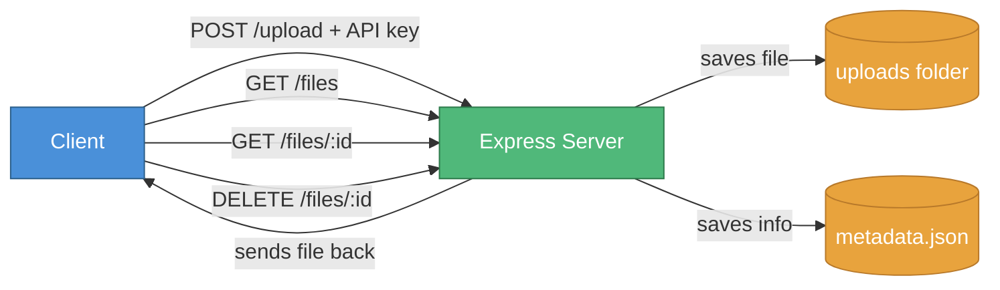

# # cloud-file-api

A small file storage API. Upload a file, get an ID back, use that ID to download or delete it later. Built with Node and Express, running out of Termux on Android.

## Setup

```
npm install
```

Make a `.env` file in the project root (don't commit this):

```
API_KEY=pick-something-random
PORT=3000
```

Then run it:

```
node index.js
```

## Routes

Every route needs a header: `x-api-key: <your key>`

| Method | Route | What it does |
|---|---|---|
| POST | /upload | Upload a file. Form field name is `file`. |
| GET | /files | List everything uploaded so far. |
| GET | /files/:id | Download one file. |
| DELETE | /files/:id | Delete one file. |

## How it works



## Example

```
curl -X POST http://localhost:3000/upload \
  -H "x-api-key: yourkey" \
  -F "file=@somefile.txt"
```

Returns the file's ID, which you then use for the other routes.

## Notes

Files are stored on disk in `uploads/`, and a `metadata.json` file keeps track of original filenames. Neither of those get committed — they're just local state.

100MB max file size right now, set in `index.js` if you want to change it.

---

Built with help from Claude (Anthropic).
